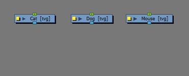
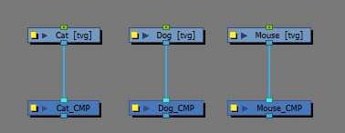

# HarmonyScripting_gettingStarted
- This is a lesson on how to get started with scripting a tool in Toon Boom Harmony.
- The following process should take 30 mins to complete

### Pre-Requisites

- Toon Boom Harmony (I'm using version `22.0.3` )
- Code Editor (I use [**Notepad ++**](https://notepad-plus-plus.org/downloads/)  or [**Visual Studio Code**](https://code.visualstudio.com/Download) )

## Step 1 : Understand the request
It is essentail that you understand what problem the user is trying to solve, you need to have clarity on what a completed request will look like.

In this case the request we are fullfulling is: 
>User want a button that adds a compositing node under (and connected to) each selected drawing node named the same as the drawing node it is attached to with "_CMP" as it's suffix

| Before Script | After Script |
| -- | --- |
|  | |

## Step 2 : Break down script steps
For this request the steps the script will need to complete are

1. Validate selection
   - get the users node selection
   - check that the selection contains `READ` nodes 
   - log if the selection is valid or invalid
2. If the selection is valid; ask the user if they want to proceed adding `COMPOSITE` nodes to them
3. Add `COMPOSITE` nodes to each of the `READ` nodes 
   - For each node
   - make a `COMPOSITE` node
   - put it directly under the `READ` node
   - change the name of the `COMPOSITE` so that it is the same as `READ` node + "_CMP"
     - if that is not possible, add a number at the end of the name like "_CMP_01"
     - keep incrementing the number until you find a valid name
   
4. tell the user what happened (Success or Failure)

## Step 3 : Write the script

### Script Settup
- From Harmony's **Script Editor** Window
  - Connect an **External Editor**
    - `C:\Program Files (x86)\Notepad++\notepad++.exe`
    - `C:\Users\USERNAME\AppData\Local\Programs\Microsoft VS Code\Code.exe`
  - Make a new script with a sensible filename
    - `BZ_addCompNodes`
  - open that script with the script editor
- Write a super basic script that uses the correct called fuction name and gives the user some feedback (ideally to the **message log** )
  - [BZ_addCompNodes_1](ScriptStages/BZ_addCompNodes_1.js)
- Now import the script into your **scripting toolbar**
- Now you have a button that you can press to call the script

### Actually writing the script
- add informative docstrings
  - [BZ_addCompNodes_2](ScriptStages/BZ_addCompNodes_2.js)
- create pseudocode to help with the expected structure
  - [BZ_addCompNodes_3](ScriptStages/BZ_addCompNodes_3.js)
- validate the users selection
- create composites under every read node
  - [BZ_addCompNodes_4](ScriptStages/BZ_addCompNodes_4.js) 
  - This is code state at the end of the video
## Step 4 : Create script icon
I use [Figma](https://www.figma.com/design/SLqk13wRGNDB3ZpJf77buo/BZ2D-Script-Icons?node-id=13-57&t=bH49zJ8YxbAOrO0w-0) to create script icons

## Step 5 : Test the script
Make sure it works in all of the following situations **or** has an error message explaining why it is not working in a particular circumstance:
- locally, connected to database 
- with nothing selected, with incorrect nodes selected
- as many Harmony versions as we have in production
- on any Show speciffic environments necessary (i.e. check export paths)
## Step 6 : Create documentation
- for the **maintainer** (whoever will need to improve or fix the script)
- for the **user**

## Step 7 : Deploy the script
As of 11.8.2024 Harmony scripts at Blue Zoo are stored here:  `//bzharmony16/USA_DB/scripts/` so that they are available to all Harmony artists working from studio machines.

To get the icon to load automatically, you put it here: `//bzharmony16/USA_DB/scripts/script-icons` and name it exactly the same as the function that is called when the button is pressed. 

i.e. `BZ_myScript_functon` in `BZ_myScript_file` would have the icon name `BZ_myScript_functon.png`